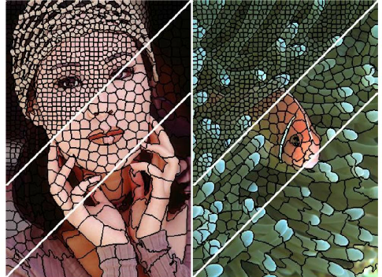

# Image manipulation and processing library

## Author
Jimmy Francky Randrianasoa

## Usage
<b>Language:</b> Java  
<b>Purpose:</b> providing a tool simplifying the management of BufferedImage  
<b>Core class:</b> [ImTool](src/utils/ImTool.java)  
<b>Getting started:</b> you can start with some [examples](src/examples)

## Illustrations

## Third-party libraries
This project bundles some third-party libraries:
- [jai_codec](http://svnsis.ethz.ch/repos/cisd/ivy-repository/trunk/sis/sis-jhdf5/14.12.1/), [jai_core](http://svnsis.ethz.ch/repos/cisd/ivy-repository/trunk/sis/sis-jhdf5/14.12.1/), [jai_imageio](http://svnsis.ethz.ch/repos/cisd/ivy-repository/trunk/sis/sis-jhdf5/14.12.1/) are parts of the <b>Java Advanced Imaging API</b> which is a set of image encoder/decoder (codec) classes - [Java Research License (JRL)](https://github.com/mauricio/jai-core/blob/master/LICENSE-JRL.txt)
